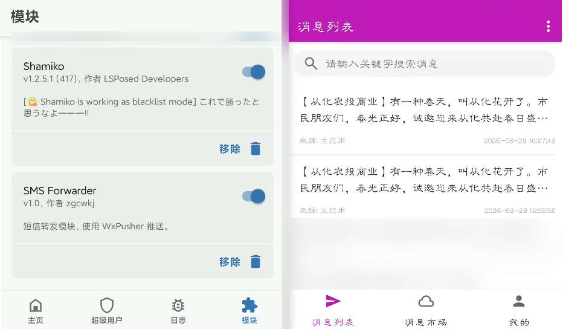

# SMS Forwarder

Magisk 模块：监听短信并通过 WxPusher 推送通知。支持 WebUI 可视化管理配置。

## 功能

- 监听手机短信收件箱，新短信自动推送到微信
- WebUI 管理页面，浏览器配置 appToken 和 UIDs
- 保存配置后自动重启转发进程，无需重启手机
- 启动时自动发送上线通知，确认服务正常运行
- 5 分钟无流量自动关闭 Web 服务，节省资源

## 配置方式

### 方式一：WebUI 页面（推荐）

#### KSU / APatch 用户
模块安装后，在管理器内点击模块即可打开内置 WebUI。

#### Magisk 用户
1. 安装模块后重启手机
2. 打开 Magisk → 模块 → SMS Forwarder → 点击 **"操作"**
3. 浏览器自动打开管理页面 `http://localhost:18080`
4. 填入 `appToken` 和 `UIDs`，点击保存
5. 收到 WxPusher 推送 "SMS Forwarder 已启动" 即表示配置成功

### 方式二：手动编辑配置文件

```
/data/adb/modules/sms_forwarder/sms_config.sh
```

修改后重启手机。

## 获取配置参数

WxPusher 管理后台：https://wxpusher.zjiecode.com/admin/main/wxuser/list

- **appToken**：应用 Token，在 WxPusher 后台 → 应用管理 中获取
- **UIDs**：接收用户 UID，在 WxPusher 后台 → 用户列表 中获取

## 技术架构

```
src/
├── action.sh              # Magisk Action 入口
├── service.sh             # 开机自启服务
├── sms_config.sh          # 配置模板
├── sms_forward.sh         # 短信转发守护进程
├── module.prop            # 模块元信息
└── webroot/
    ├── index.html         # WebUI 页面
    ├── config.json        # KSU WebUI 配置
    ├── save.sh            # HTTP 服务（nc -L 单端口）
    └── save_worker.sh     # 连接处理器（静态文件 + 保存）
```

- **单端口 18080**：同时处理静态文件和配置保存请求
- **nc -L**：使用 toybox nc 多连接模式，替代 busybox httpd
- **空闲退出**：5 分钟无请求自动关闭，节省资源

## 图片预览


